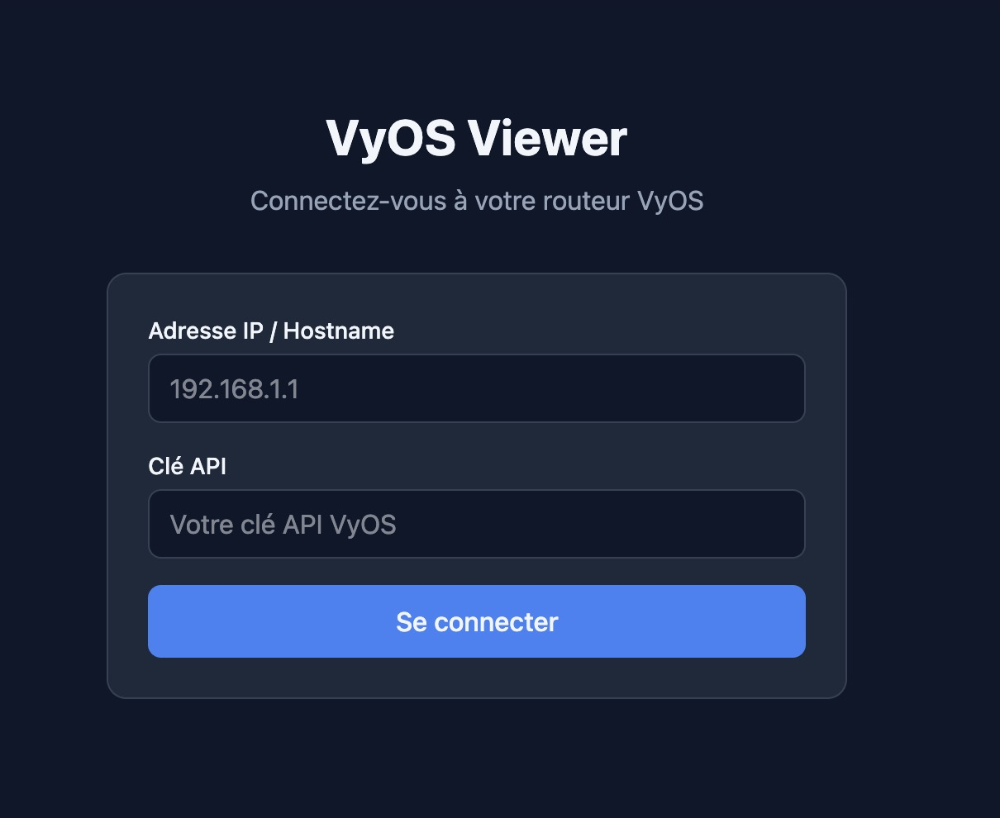
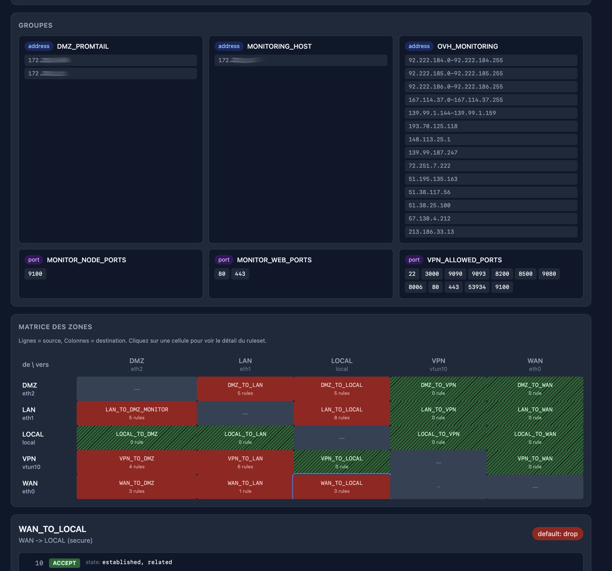
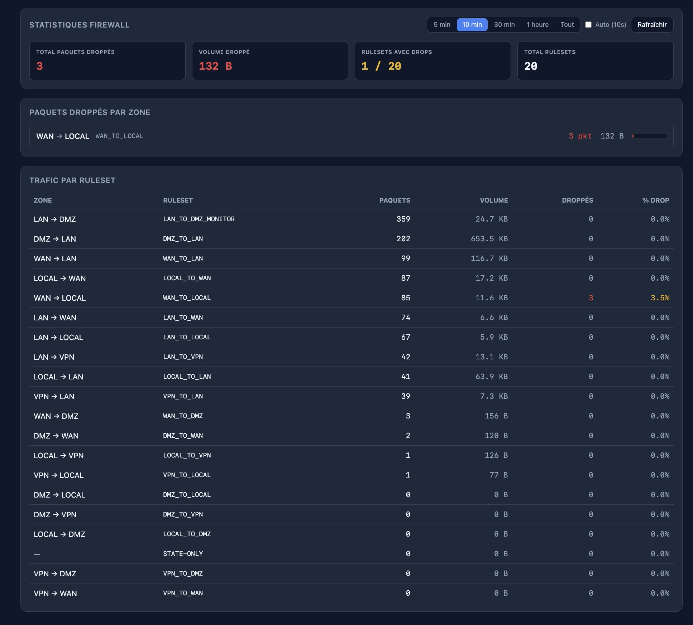
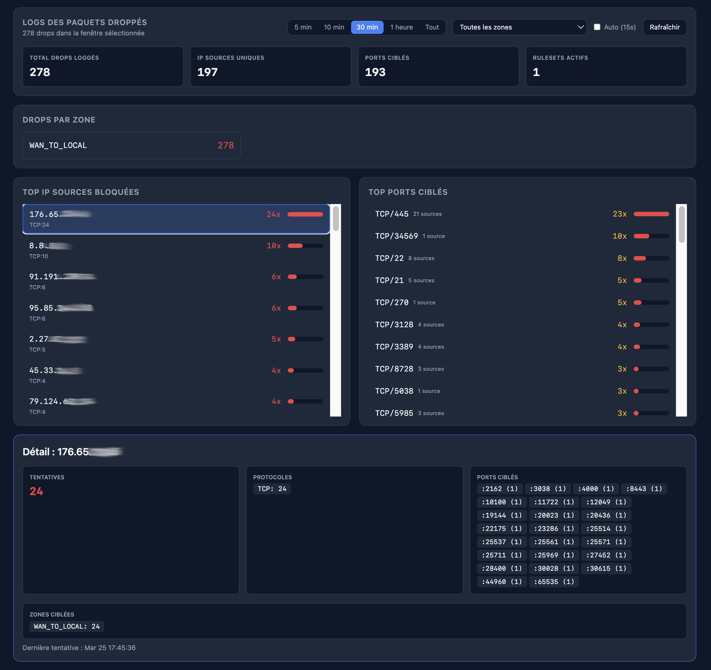
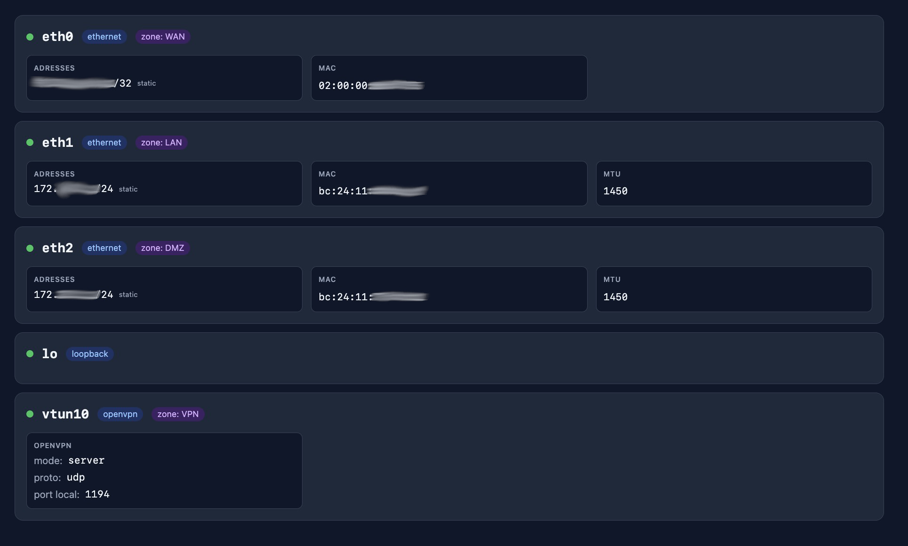
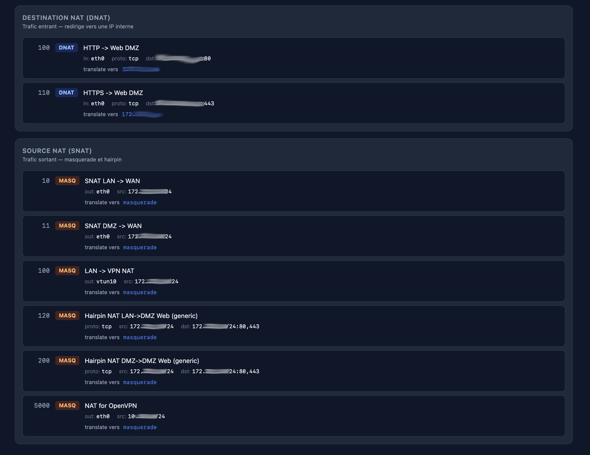
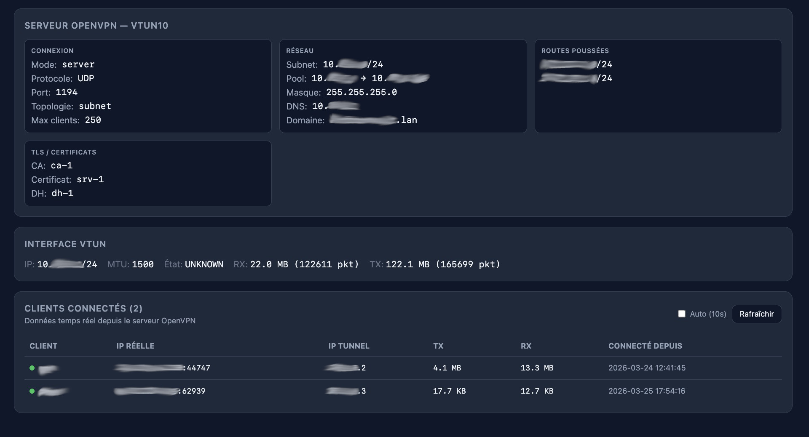

# VyOS Viewer

A web-based dashboard for visualizing and monitoring VyOS router configurations. Provides a clear, graphical representation of firewall rules, zones, NAT, interfaces, and OpenVPN — making it easy to understand complex configurations at a glance.

## Screenshots

| Login | Firewall |
|:---:|:---:|
|  |  |

| Stats Firewall | Drop Logs |
|:---:|:---:|
|  |  |

| Interfaces | NAT |
|:---:|:---:|
|  |  |

| OpenVPN |
|:---:|
|  |

## Features

- **Firewall visualization**: zone matrix with color-coded default actions (accept/drop), rule groups, address/port groups, global options
- **Live firewall statistics**: real-time packet/byte counters per ruleset, drop percentages
- **Drop log analysis**: top blocked IPs, targeted ports, per-zone filtering, time window selection (5min/10min/30min/1h)
- **Interfaces overview**: status, IP addresses, traffic counters for all interfaces
- **NAT rules**: DNAT and SNAT visualization with translation details
- **OpenVPN monitoring**: server configuration, connected clients in real-time with traffic stats

## Prerequisites

- **Node.js** 20+
- A **VyOS router** with the HTTPS API enabled
- Network access from the machine running VyOS Viewer to the VyOS API (port 443)

> **Note**: This project has only been tested on **VyOS 1.5** (rolling). It may work on 1.3 and 1.4 but this has not been verified.

## VyOS API Setup

### 1. Generate an API key

Connect to your VyOS router and enter configuration mode:

```bash
configure
```

Create an API key (replace `YOUR_SECRET_KEY` with a strong random string):

```bash
set service https api keys id MY_APP key 'YOUR_SECRET_KEY'
```

### 2. Enable the HTTPS API

```bash
set service https api
commit
save
```

You will see a warning about self-signed certificates — this is expected and not an issue for internal use:

```
WARNING: No certificate specified, using built-in self-signed
certificates. Do not use them in a production environment!
```

### 3. Verify the API is working

From any machine with network access to the router:

```bash
curl -k -X POST https://YOUR_VYOS_IP/retrieve \
  -H "Content-Type: application/json" \
  -d '{"op": "showConfig", "path": ["firewall"], "key": "YOUR_SECRET_KEY"}'
```

You should receive a JSON response with your firewall configuration.

### 4. Firewall rule (if needed)

If VyOS Viewer runs on a machine in a zone that doesn't have access to the router's HTTPS port (443), you need to add a firewall rule. For example, if the machine is in the LAN zone:

```bash
configure
set firewall ipv4 name LAN_TO_LOCAL rule 60 action 'accept'
set firewall ipv4 name LAN_TO_LOCAL rule 60 description 'HTTPS API access'
set firewall ipv4 name LAN_TO_LOCAL rule 60 destination port '443'
set firewall ipv4 name LAN_TO_LOCAL rule 60 protocol 'tcp'
commit
save
```

### 5. Enable firewall drop logging (optional, recommended)

To get detailed information about blocked packets in the Drops tab, enable logging on your drop rulesets:

```bash
configure
set firewall ipv4 name WAN_TO_LOCAL default-log
set firewall ipv4 name WAN_TO_DMZ default-log
set firewall ipv4 name WAN_TO_LAN default-log
# Add for any other ruleset with default-action drop
commit
save
```

## Installation

### Local development

```bash
git clone https://github.com/YOUR_USER/vyos-viewer.git
cd vyos-viewer
npm install
npm run dev
```

Open [http://localhost:3000](http://localhost:3000) in your browser.

### Production deployment

```bash
git clone https://github.com/YOUR_USER/vyos-viewer.git
cd vyos-viewer
npm install
npm run build
npm run start
```

The app listens on port 3000 by default. Set the `PORT` environment variable to change it.

### Run as a systemd service

```bash
sudo cat > /etc/systemd/system/vyos-viewer.service << 'EOF'
[Unit]
Description=VyOS Viewer
After=network.target

[Service]
Type=simple
WorkingDirectory=/opt/vyos-viewer
ExecStart=/usr/bin/npm run start
Restart=always
Environment=NODE_ENV=production
Environment=PORT=3000

[Install]
WantedBy=multi-user.target
EOF

sudo systemctl daemon-reload
sudo systemctl enable --now vyos-viewer
```

## Usage

1. Open VyOS Viewer in your browser
2. Enter your VyOS router IP address and API key
3. Click **Se connecter**
4. Navigate between tabs: **Interfaces**, **NAT**, **OpenVPN**, **Firewall**, **Stats Firewall**, **Drops**

## Tech Stack

- [Next.js](https://nextjs.org/) 15 (App Router)
- [TypeScript](https://www.typescriptlang.org/)
- [Tailwind CSS](https://tailwindcss.com/) 4

## Security Notes

- API keys are stored in browser session storage only — they are never persisted on the server
- All VyOS API calls are proxied through the Next.js backend to avoid exposing credentials to the browser
- The connection to VyOS uses HTTPS with self-signed certificate validation disabled (`rejectUnauthorized: false`)

## License

MIT
